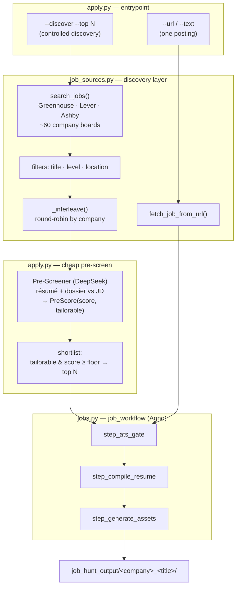
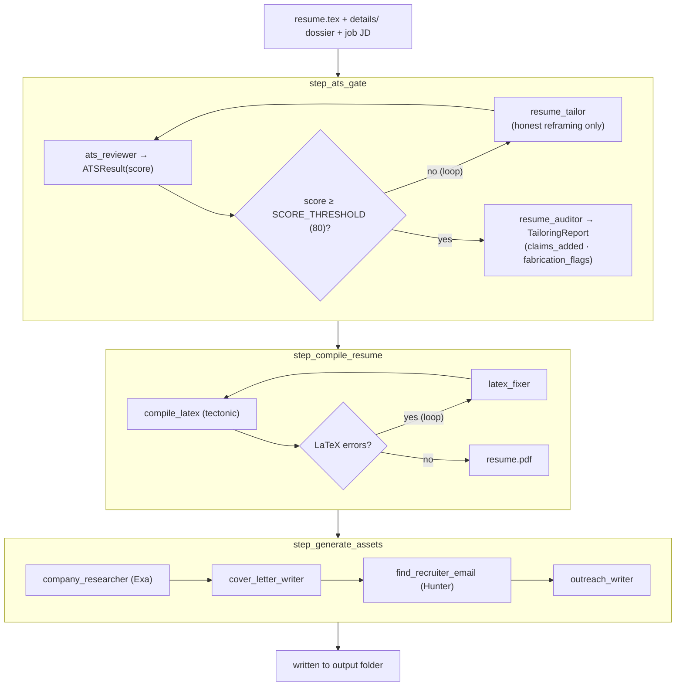

# JobScanner

**An agentic job-application pipeline.** Give it a job posting (or let it discover roles), and it scores your résumé against the Job description, *honestly* tailors a LaTeX résumé to clear an ATS threshold, then writes a matching cover letter and a recruiter-outreach email — all grounded in your real experience. Nothing is ever auto-sent.

Built on [Agno](https://github.com/agno-agi/agno) for multi-agent orchestration, Anthropic Claude for the writing/reasoning agents, and free public job-board APIs (Greenhouse / Lever / Ashby) for discovery.

---

## What it does

- **Scores** your résumé against a job description (ATS-style, 0–100).
- **Tailors** the résumé *only by reframing real experience* — a dedicated auditor agent flags anything added, so nothing is fabricated.
- **Compiles** the tailored `.tex` to PDF and self-heals LaTeX errors.
- **Researches** the company (via Exa) and drafts a tailored cover letter + cold-outreach email.
- **Finds** a recruiter contact (via Hunter, with a public-page fallback) — but only drafts the email; it never sends.
- **Discovers** roles across ~60 AI/ML company boards with a cheap pre-screen so the expensive pipeline only runs on the best matches.

---

## Workflow

### High-level pipeline



### Inside `job_workflow` (the engine)



---

## Project structure & how the pieces relate

```
JobScanner/
├── apply.py            # ENTRYPOINT — CLI, pre-screen gate, controlled discovery
├── jobs.py             # ENGINE — the Agno workflow, all agents, tools, schemas
├── job_sources.py      # DISCOVERY — free job-board fetchers, filters, URL intake
├── requirements.txt
├── resume.tex          # your master one-page résumé (the pipeline's input)
└── details/            # your dossier: extra real experience the tailor can draw on
    ├── nullset.md
    ├── agentscribe.md
    ├── research.md
    ├── projects.md
    └── conceptual_depth.md
```

The three modules form a clean dependency chain — **`apply.py` → `jobs.py` → `job_sources.py`** — so you only ever *run* `apply.py`:

| File | Role | Key exports | Used by |
| --- | --- | --- | --- |
| **`apply.py`** | Entrypoint & orchestration. Parses the CLI, runs the cheap **`Pre-Screener`** agent (`PreScore`), interleaves and shortlists candidates, and calls the engine on each. | `apply_from_url`, `apply_from_text`, `discover_and_apply`, `_interleave`, `_load_inputs` | you (CLI) |
| **`jobs.py`** | The engine. Defines the Agno `job_workflow` and every agent/tool. Edit this to change *how* the system reasons, tailors, and writes. | `job_workflow`, `load_dossier`, `CANDIDATE_PROFILE`, `SCORE_THRESHOLD` | `apply.py` |
| **`job_sources.py`** | The discovery layer. Auto-detects each company's ATS (Greenhouse → Lever → Ashby) and normalizes postings. Edit this to change *what* gets searched. | `search_jobs`, `fetch_job_from_url`, `COMPANIES` | `apply.py`, `jobs.py` |

### Agents & schemas (all live in `jobs.py`)

- **`ats_reviewer`** → `ATSResult` — scores résumé vs JD.
- **`resume_tailor`** — reframes real experience into the JD's vocabulary; hard no-fabrication rules.
- **`resume_auditor`** → `TailoringReport` — lists `claims_added`, `honest_gaps`, `fabrication_flags`.
- **`latex_fixer`** — repairs compile errors.
- **`company_researcher`** (Exa) → **`cover_letter_writer`** → **`outreach_writer`** — the asset chain.
- **`Pre-Screener`** (in `apply.py`) → `PreScore(score, tailorable, reason)` — the cheap discovery gate.

**Tools:** `search_jobs`, `find_recruiter_email` (Hunter + public-page fallback, human-gated), `compile_latex` (tectonic → xelatex → pdflatex).

---

## Installation

> Requires **Python 3.10+**. A virtual environment is strongly recommended so the pinned Agno version doesn't collide with your global packages.

```bash
# 1. clone
git clone https://github.com/jainary4/JobScanner.git
cd JobScanner

# 2. create & activate a virtual environment
python3 -m venv .venv
source .venv/bin/activate          # Windows: .venv\Scripts\activate

# 3. install dependencies
pip install -r requirements.txt
```

`requirements.txt` pins `agno==2.6.17` plus `anthropic`, `exa_py`, `requests`, and `pydantic`.

**LaTeX (for PDF output).** The résumé compiles via `tectonic`. Without it you still get the tailored `.tex`, just no PDF:

```bash
conda install -c conda-forge tectonic     # easiest — prebuilt binary
# or:  brew install tectonic   /   brew install --cask basictex
```

### API keys

Set these as environment variables (only the first is strictly required):

```bash
export ANTHROPIC_API_KEY=...     # required — the writing/reasoning agents
export DEEPSEEK_API_KEY=...      # the cheap discovery pre-screener
export EXA_API_KEY=...           # recommended — company research for cover letters
export HUNTER_API_KEY=...        # optional — recruiter-email lookup
# optional extra job source:
export ADZUNA_APP_ID=...  ;  export ADZUNA_APP_KEY=...
```

### Set up your inputs

- Put your master one-page résumé at **`resume.tex`**.
- Fill **`details/`** with markdown notes on your real projects and experience. The tailor and pre-screener read these to surface things that aren't on the short résumé — so the richer this folder, the better the matches. (`conceptual_depth.md` is treated as interview knowledge, *not* converted into experience bullets.)

---

## Usage — running in different modes

```bash
# A) You have a posting URL → full tailored package
python apply.py --url "https://jobs.lever.co/somecompany/abc-123"

# B) Fetch failed / you only have the text → paste the JD
python apply.py --text jd.txt --company "Cohere" --title "ML Engineer" --url "https://..."

# C) Let it discover roles (entry-level, Toronto + SF) and run on the best N
python apply.py --discover --top 5

# Search internships instead of full-time
python apply.py --discover --top 5 --intern
```

| Mode | Flag | What it does |
| --- | --- | --- |
| **Single posting** | `--url <URL>` | Parses one Greenhouse/Lever/Ashby posting and runs the full pipeline. |
| **Pasted JD** | `--text <file> --company --title` | Use when a URL won't parse; feeds raw JD text into the pipeline. |
| **Controlled discovery** | `--discover --top N` | Searches all boards, pre-screens cheaply, and runs the full pipeline on only the top `N` honestly-tailorable matches. |

---

## Expected output

**Console** (discovery mode) — the pre-screen scores stream in, then a shortlist, then per-job ATS results:

```
[search_jobs] probed 59 companies -> 646 candidate role(s)
   70  tailorable=True   Forward Deployed Engineer, Agentic Platform @ cohere
   65  tailorable=True   Research Internship/Co-op @ waabi
   ...
=== Shortlist (5 of 60 scored, floor=55, threshold=80) ===
  88  Forward Deployed Engineer, Agentic Platform @ cohere — strong agentic match
...
--- Forward Deployed Engineer, Agentic Platform @ cohere ---
  ATS Forward Deployed Engineer: 88 (PASS), 1 tailor round(s)
  resume.tex/.pdf written -> job_hunt_output/cohere_Forward_Deployed_Engineer_Agentic_Platform
  wrote cover_letter.txt, outreach_email.txt, recruiter.json, tailoring_report.json
```

**Files** — one folder per job under `job_hunt_output/`:

```
job_hunt_output/
└── cohere_Forward_Deployed_Engineer_Agentic_Platform/
    ├── resume.tex              # the tailored résumé (LaTeX source)
    ├── resume.pdf              # compiled PDF (if a LaTeX compiler is installed)
    ├── cover_letter.txt        # company-tailored cover letter
    ├── outreach_email.txt      # cold email draft to a recruiter (NOT sent)
    ├── recruiter.json          # recruiter contact, if found
    └── tailoring_report.json   # what was changed: claims_added, honest_gaps, fabrication_flags
```

The **`tailoring_report.json`** is the honesty ledger: read it before you submit so you know exactly which claims the tailor added and can defend each in an interview.

---

## Configuration

Common knobs (top of `apply.py` / `jobs.py`):

- `SCORE_THRESHOLD` — ATS pass bar (default **80**).
- `MAX_PRESCREEN` — how many candidates the cheap gate scores per run.
- `pre_floor` — minimum pre-screen score to make the shortlist.
- `COMPANIES` (in `job_sources.py`) — the list of company board slugs to search.
- `RESUME_PATH`, `DETAILS_DIR` — where your résumé and dossier live.

---

## Design notes

- **Honest tailoring by construction.** The tailor reframes real experience and lists transferable tools; it never fabricates hands-on use of tools you haven't touched. The auditor surfaces every addition so you stay in control.
- **Human-in-the-loop.** Recruiter emails are *drafted*, never sent. You review everything before anything leaves your machine.
- **Cost-aware discovery.** A cheap model triages many candidates; the expensive Claude pipeline only runs on the shortlist.

